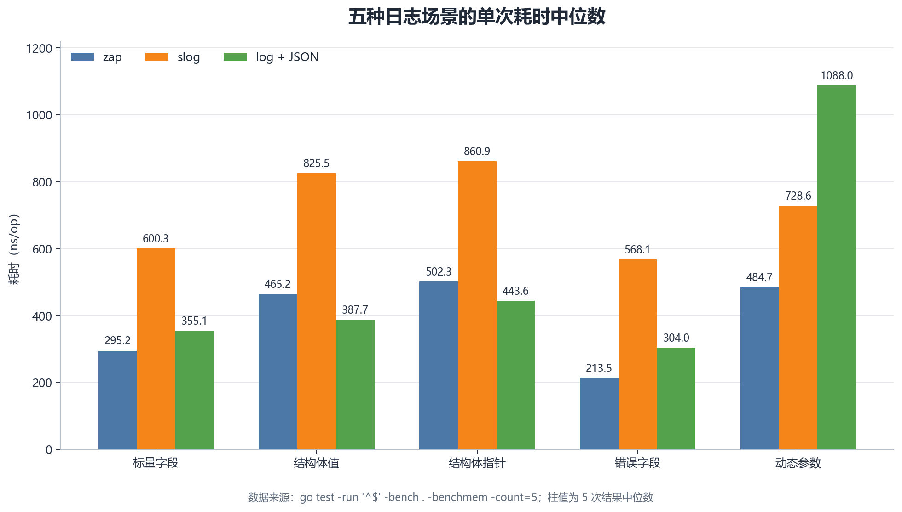
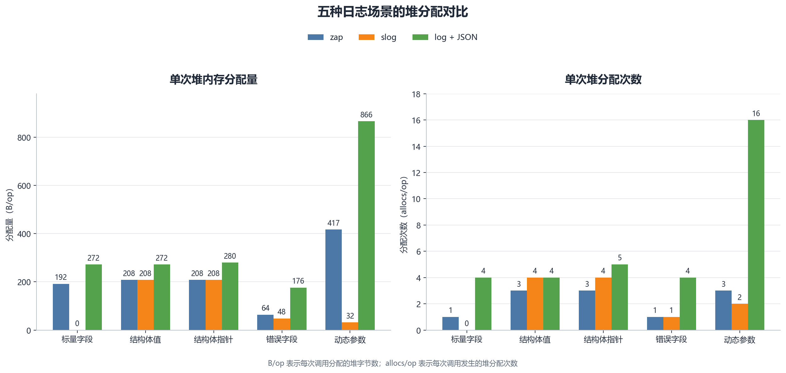

# Go日志库工程选型与逃逸分析评测报告

本实验在统一 **JSON 字段**、**日志级别**、**输出目标**和**运行环境**的条件下，对 `zap`、`log/slog` 与`标准库 log` 三种日志方案进行横向评测。

实验通过 Go Benchmark 采集 `ns/op`、`B/op` 和 `allocs/op`，并结合编译器 `-m=2` 逃逸分析定位堆分配来源。

**结果显示：**
  `zap` 在五个场景中的三个场景取得最低耗时；
  `slog` 在强类型标量字段场景实现 0 B/op 和 0 allocs/op，但运行耗时并非最低；
  `标准库 log` + `encoding/json` 在动态参数场景达到 866 B/op 和 16 allocs/op。

> 实验表明，日志组件选型需要同时考察**调用耗时**、**堆分配**、**接口表达能力**和**依赖成本**，不能仅以零分配或单次耗时作结论。

### 研究背景

Go **编译器**会根据变量的**生命周期**和**引用关系**决定其存放在**栈**还是**堆**上。

变量一旦逃逸到堆，就需要由`GC`管理。

在**高频日志路径**中，`可变参数`、`any 接口装箱`、`反射编码`、`结构体取地址`和`动态 map` 都可能引入堆分配。

**单次日志**调用的分配量不大，但在高吞吐服务中会被请求量放大，进而增加 GC 扫描、内存占用和尾延迟风险。

zap、log/slog 与标准库 log 采用不同的字段模型。

- zap 提供强类型 `zap.Field` 和动态 `SugaredLogger`；
- slog 提供强类型 `slog.Attr` 和键值参数接口；
- 标准库 log 仅负责文本输出，要生成结构化 JSON 必须配合额外编码。

本实验以**完成等价结构化日志任务**为前提，评估三种方案的实际代价。

## 实验设计

为保证评测公平有效，测试在以下设计约束下开展：

- **字段语义严格对齐**：
  - 同一 Benchmark 分组内的三种方案记录相同消息和业务字段；
  - **标量与动态参数场景**使用 `msg`、`request_id`、`path`、`status`
  - **结构体场景**使用 `msg` 和 `request`
  - **错误场景**使用 `msg` 和 `error`
  - 三者统一屏蔽时间戳与日志级别字段，消除额外元数据格式化的干扰。
- **规避短路优化**：
  - 三者都处于 `Info` 启用状态，并经不透明写入器统一转发到 `io.Discard`。
  - `标准库 log` 若检测到输出目标为直接的 `io.Discard`，会触发内部优化直接跳过字符串格式化。
  - 测试通过包装不透明写入器 `opaqueDiscard` 统一将输出重定向至空操作，确保参数构建、逃逸分析与序列化路径完整执行，
  - 同时剥离`磁盘`和`终端 I/O` 的偶然影响。
- **原生接口调用**：
  - `Benchmark` 使用三者的原生 API
  - `zap` 区分`强类型 zap.Field` 与`动态键值的 SugaredLogger`；
  - `slog` 区分`强类型 slog.Attr` 与`键值对形式的动态接口`；
  - `标准库 log` + `encoding/json 序列化结构体`后交由 `Logger.Print` 处理。


### 研究问题  - 这个大家通过数据自行观察吧!

- RQ1：在输出语义一致时，哪种日志方案的单次调用耗时最低？
- RQ2：`强类型字段接口`与`动态键值接口`的堆分配差异有多大？
- RQ3：`结构体按值`传递与`按指针`传递分别会触发哪些逃逸？
- RQ4：`ns/op`、`B/op` 与 `allocs/op` 是否呈现一致的优劣关系？

### 场景

- `BenchmarkPrimitiveFields`：字符串、整数等标量字段。zap 使用 `zap.String`、`zap.Int` 构造强类型 `zap.Field`；slog 使用 `LogAttrs` 配合 `slog.String`、`slog.Int`；log 将相同字段写入 `primitiveRecord`，通过 `encoding/json` 编码后交给 `log.Logger` 输出。
- `BenchmarkStructuredValue`：结构体按值传入通用字段。zap 使用 `zap.Any("request", request)`；slog 使用 `slog.Any("request", request)`；log 将结构体值写入 `structuredValueRecord`，通过 `encoding/json` 编码后输出。
- `BenchmarkStructuredPointer`：结构体指针传入通用字段。zap 使用 `zap.Any("request", &request)`；slog 使用 `slog.Any("request", &request)`；log 将 `&request` 写入 `structuredPointerRecord`，通过 `encoding/json` 编码后输出。该场景用于观察局部 `request` 取地址后是否被移动到堆上。
- `BenchmarkErrorField`：`error` 作为日志字段。zap 使用 `zap.Error(benchmarkError)`；slog 使用 `slog.Any("error", benchmarkError)`；log 调用 `benchmarkError.Error()` 得到字符串，写入 `errorRecord` 后进行 JSON 编码和输出。
- `BenchmarkDynamicArguments`：运行时动态键值参数。zap 使用 `SugaredLogger.Infow` 接收 `...any` 键值对；slog 使用 `Logger.Info` 接收 `...any` 键值对；log 没有原生结构化字段 API，因此使用 `map[string]any` 保存动态字段，再通过 `encoding/json` 编码后输出。

## 运行

```powershell
go mod download
go run .
go test -run '^$' -bench . -benchmem -count=5
```

查看本项目代码的编译器逃逸判断：

```powershell
go test -run '^$' -gcflags='go-escape-logging-lab=-m=2' 2>&1 |
  Select-String 'logging_benchmark_test\.go:' |
  Select-String 'request|record|\.\.\. argument|map\[string\]any|slog\.Any' |
  Select-String 'escapes to heap|moved to heap|does not escape'
```

## 解读结果

### `go run .`

```bash
等价 JSON 日志耗时：每种日志系统记录 1000000 次
zap：总耗时 283.8869ms，平均 283.9 ns/op
slog：总耗时 595.0523ms，平均 595.1 ns/op
log+encoding/json：总耗时 396.0738ms，平均 396.1 ns/op
```

### `go test -run '^$' -bench . -benchmem -count=5`

```bash
goos: windows
goarch: amd64
pkg: go-escape-logging-lab
cpu: 12th Gen Intel(R) Core(TM) i9-12900H
BenchmarkPrimitiveFields/zap_typed-20            4015316               302.1 ns/op           192 B/op          1 allocs/op
BenchmarkPrimitiveFields/zap_typed-20            3975543               295.2 ns/op           192 B/op          1 allocs/op
BenchmarkPrimitiveFields/zap_typed-20            3933627               291.9 ns/op           192 B/op          1 allocs/op
BenchmarkPrimitiveFields/zap_typed-20            4231836               293.5 ns/op           192 B/op          1 allocs/op
BenchmarkPrimitiveFields/zap_typed-20            4223890               296.6 ns/op           192 B/op          1 allocs/op
BenchmarkPrimitiveFields/slog_attrs-20           1854670               625.7 ns/op             0 B/op          0 allocs/op
BenchmarkPrimitiveFields/slog_attrs-20           1998180               600.0 ns/op             0 B/op          0 allocs/op
BenchmarkPrimitiveFields/slog_attrs-20           2021539               596.6 ns/op             0 B/op          0 allocs/op
BenchmarkPrimitiveFields/slog_attrs-20           2006443               600.5 ns/op             0 B/op          0 allocs/op
BenchmarkPrimitiveFields/slog_attrs-20           2016734               600.3 ns/op             0 B/op          0 allocs/op
BenchmarkPrimitiveFields/log_json-20             3295974               362.3 ns/op           272 B/op          4 allocs/op
BenchmarkPrimitiveFields/log_json-20             3417949               350.3 ns/op           272 B/op          4 allocs/op
BenchmarkPrimitiveFields/log_json-20             3380252               356.2 ns/op           272 B/op          4 allocs/op
BenchmarkPrimitiveFields/log_json-20             3453411               350.9 ns/op           272 B/op          4 allocs/op
BenchmarkPrimitiveFields/log_json-20             3377373               355.1 ns/op           272 B/op          4 allocs/op
BenchmarkStructuredValue/zap_any-20              2513391               467.2 ns/op           208 B/op          3 allocs/op
BenchmarkStructuredValue/zap_any-20              2534437               469.0 ns/op           208 B/op          3 allocs/op
BenchmarkStructuredValue/zap_any-20              2591865               459.3 ns/op           208 B/op          3 allocs/op
BenchmarkStructuredValue/zap_any-20              2552637               465.2 ns/op           208 B/op          3 allocs/op
BenchmarkStructuredValue/zap_any-20              2622271               461.4 ns/op           208 B/op          3 allocs/op
BenchmarkStructuredValue/slog_any-20             1469733               820.2 ns/op           208 B/op          4 allocs/op
BenchmarkStructuredValue/slog_any-20             1474182               811.1 ns/op           208 B/op          4 allocs/op
BenchmarkStructuredValue/slog_any-20             1466842               837.2 ns/op           208 B/op          4 allocs/op
BenchmarkStructuredValue/slog_any-20             1440254               836.8 ns/op           208 B/op          4 allocs/op
BenchmarkStructuredValue/slog_any-20             1452955               825.5 ns/op           208 B/op          4 allocs/op
BenchmarkStructuredValue/log_json-20             3125858               381.6 ns/op           272 B/op          4 allocs/op
BenchmarkStructuredValue/log_json-20             3113824               385.3 ns/op           272 B/op          4 allocs/op
BenchmarkStructuredValue/log_json-20             3162194               387.7 ns/op           272 B/op          4 allocs/op
BenchmarkStructuredValue/log_json-20             3126900               401.3 ns/op           272 B/op          4 allocs/op
BenchmarkStructuredValue/log_json-20             2638108               428.8 ns/op           272 B/op          4 allocs/op
BenchmarkStructuredPointer/zap_any-20            2388843               494.8 ns/op           208 B/op          3 allocs/op
BenchmarkStructuredPointer/zap_any-20            2422657               502.6 ns/op           208 B/op          3 allocs/op
BenchmarkStructuredPointer/zap_any-20            2436566               490.7 ns/op           208 B/op          3 allocs/op
BenchmarkStructuredPointer/zap_any-20            2156502               539.6 ns/op           208 B/op          3 allocs/op
BenchmarkStructuredPointer/zap_any-20            2372210               502.3 ns/op           208 B/op          3 allocs/op
BenchmarkStructuredPointer/slog_any-20           1406115               861.7 ns/op           208 B/op          4 allocs/op
BenchmarkStructuredPointer/slog_any-20           1353315               876.6 ns/op           208 B/op          4 allocs/op
BenchmarkStructuredPointer/slog_any-20           1416532               846.6 ns/op           208 B/op          4 allocs/op
BenchmarkStructuredPointer/slog_any-20           1401900               860.9 ns/op           208 B/op          4 allocs/op
BenchmarkStructuredPointer/slog_any-20           1396575               860.6 ns/op           208 B/op          4 allocs/op
BenchmarkStructuredPointer/log_json-20           2672620               447.7 ns/op           280 B/op          5 allocs/op
BenchmarkStructuredPointer/log_json-20           2832130               444.9 ns/op           280 B/op          5 allocs/op
BenchmarkStructuredPointer/log_json-20           2698550               443.6 ns/op           280 B/op          5 allocs/op
BenchmarkStructuredPointer/log_json-20           2750589               436.5 ns/op           280 B/op          5 allocs/op
BenchmarkStructuredPointer/log_json-20           2767726               441.6 ns/op           280 B/op          5 allocs/op
BenchmarkErrorField/zap_error-20                 5524418               215.1 ns/op            64 B/op          1 allocs/op
BenchmarkErrorField/zap_error-20                 5593867               213.2 ns/op            64 B/op          1 allocs/op
BenchmarkErrorField/zap_error-20                 5557293               216.3 ns/op            64 B/op          1 allocs/op
BenchmarkErrorField/zap_error-20                 5459619               213.5 ns/op            64 B/op          1 allocs/op
BenchmarkErrorField/zap_error-20                 5707382               213.4 ns/op            64 B/op          1 allocs/op
BenchmarkErrorField/slog_any-20                  2120788               563.5 ns/op            48 B/op          1 allocs/op
BenchmarkErrorField/slog_any-20                  2116220               575.4 ns/op            48 B/op          1 allocs/op
BenchmarkErrorField/slog_any-20                  2148348               561.9 ns/op            48 B/op          1 allocs/op
BenchmarkErrorField/slog_any-20                  2105664               573.9 ns/op            48 B/op          1 allocs/op
BenchmarkErrorField/slog_any-20                  2129208               568.1 ns/op            48 B/op          1 allocs/op
BenchmarkErrorField/log_json-20                  4061157               302.8 ns/op           176 B/op          4 allocs/op
BenchmarkErrorField/log_json-20                  4041626               307.8 ns/op           176 B/op          4 allocs/op
BenchmarkErrorField/log_json-20                  4011074               301.2 ns/op           176 B/op          4 allocs/op
BenchmarkErrorField/log_json-20                  3937196               305.8 ns/op           176 B/op          4 allocs/op
BenchmarkErrorField/log_json-20                  3972204               304.0 ns/op           176 B/op          4 allocs/op
BenchmarkDynamicArguments/zap_sugared-20         2525956               483.4 ns/op           417 B/op          3 allocs/op
BenchmarkDynamicArguments/zap_sugared-20         2577637               477.4 ns/op           417 B/op          3 allocs/op
BenchmarkDynamicArguments/zap_sugared-20         2437898               487.4 ns/op           417 B/op          3 allocs/op
BenchmarkDynamicArguments/zap_sugared-20         2478033               484.7 ns/op           417 B/op          3 allocs/op
BenchmarkDynamicArguments/zap_sugared-20         2488918               495.4 ns/op           417 B/op          3 allocs/op
BenchmarkDynamicArguments/slog_key_values-20     1673284               728.6 ns/op            32 B/op          2 allocs/op
BenchmarkDynamicArguments/slog_key_values-20     1671285               725.1 ns/op            32 B/op          2 allocs/op
BenchmarkDynamicArguments/slog_key_values-20     1683010               716.3 ns/op            32 B/op          2 allocs/op
BenchmarkDynamicArguments/slog_key_values-20     1651778               730.1 ns/op            32 B/op          2 allocs/op
BenchmarkDynamicArguments/slog_key_values-20     1664054               729.3 ns/op            32 B/op          2 allocs/op
BenchmarkDynamicArguments/log_json_map-20        1000000              1091 ns/op             866 B/op         16 allocs/op
BenchmarkDynamicArguments/log_json_map-20        1000000              1087 ns/op             866 B/op         16 allocs/op
BenchmarkDynamicArguments/log_json_map-20        1000000              1098 ns/op             866 B/op         16 allocs/op
BenchmarkDynamicArguments/log_json_map-20        1000000              1088 ns/op             866 B/op         16 allocs/op
BenchmarkDynamicArguments/log_json_map-20        1000000              1083 ns/op             866 B/op         16 allocs/op
PASS
ok      go-escape-logging-lab   89.793s
```
> zap 整体耗时较低，slog 堆分配最少，log 在动态参数场景分配最多。

**怎么看?**
- `ns/op`：单次耗时，越低越快。
- `B/op`：单次堆分配字节数，越低越好。
- `allocs/op`：单次堆分配次数，越低越好。
- `-count=5`：每项重复五次，应看五次的中间趋势。
- 名称后的 `-20` 表示使用了 20 个逻辑处理器，不是运行次数。


**具体观察：**
- 标量字段：zap 约 295 ns/op，最快；slog 为 0 B/op、0 allocs/op，完全没有堆分配，但耗时约 600 ns/op。
- 结构体值：log 约 385 ns/op，略快于 zap 的 465 ns/op；slog 约 825 ns/op。
- 结构体指针：log 从值类型的 272 B、4 次分配 上升到 280 B、5 次分配，说明指针路径增加了一次堆分配。
- 错误字段：zap 约 214 ns/op，最快；log 约 304 ns/op；slog 约 568 ns/op。
- 动态参数：log 使用 map + encoding/json 后达到 866 B/op、16 allocs/op，分配最多；zap 约 484 ns/op，速度最快。


**标量字段场景**
- zap（强类型）：单次耗时约 295 ns，单次分配 192 字节，堆分配 1 次。
- slog（强类型 Attrs）：单次耗时约 600 ns，单次分配 0 字节，堆分配 0 次。
- log + JSON：单次耗时约 355 ns，单次分配 272 字节，堆分配 4 次。

**结构体传值场景**
- zap：单次耗时约 465 ns，单次分配 208 字节，堆分配 3 次。
- slog：单次耗时约 825 ns，单次分配 208 字节，堆分配 4 次。
- log + JSON：单次耗时约 390 ns，单次分配 272 字节，堆分配 4 次。

**结构体传指针场景**
- zap：单次耗时约 500 ns，单次分配 208 字节，堆分配 3 次。
- slog：单次耗时约 860 ns，单次分配 208 字节，堆分配 4 次。
- log + JSON：单次耗时约 440 ns，单次分配 280 字节，堆分配 5 次。

**错误字段场景**
- zap：单次耗时约 214 ns，单次分配 64 字节，堆分配 1 次。
- slog：单次耗时约 568 ns，单次分配 48 字节，堆分配 1 次。
- log + JSON：单次耗时约 304 ns，单次分配 176 字节，堆分配 4 次。

**运行时动态参数场景**
- zap（SugaredLogger）：单次耗时约 484 ns，单次分配 417 字节，堆分配 3 次。
- slog（键值对参数）：单次耗时约 725 ns，单次分配 32 字节，堆分配 2 次。
- log + JSON（map 动态传参）：单次耗时约 1090 ns，单次分配 866 字节，堆分配 16 次。




图 1 展示五种场景的单次耗时中位数。

- `zap` 在**标量字段**、**错误字段**和**动态参数场景**耗时最低；
- `log + JSON` 在**结构体值**和**结构体指针**场景耗时略低；
- `slog` 在本实验五个场景中均未取得最低耗时。



图 2 同时展示 `B/op` 与 `allocs/op`。

- `slog` 在**标量字段场景**达到零分配，并在**错误字段**和**动态参数场景**保持较低分配；
- `log + JSON` 在**动态 map 场景**出现最明显的分配放大；
- `zap` 的耗时优势并不依赖零分配。


### 编译器逃逸判断

```bash
go test -run '^$' -gcflags='go-escape-logging-lab=-m=2' 2>&1 |
  Select-String 'logging_benchmark_test\.go:' |
  Select-String 'request|record|\.\.\. argument|map\[string\]any|slog\.Any' |
  Select-String 'escapes to heap|moved to heap|does not escape'
```

示例输出已删除编译器重复提示，`#` 后是对应解释：

```bash
# 标量字段
./logging_benchmark_test.go:52:15: ... argument escapes to heap          # zap 的 []zap.Field 可变参数底层数组逃逸到堆
./logging_benchmark_test.go:65:19: ... argument does not escape          # slog 的 []slog.Attr 可变参数切片留在栈上
./logging_benchmark_test.go:84:25: record escapes to heap                # log 的 JSON 记录装入 any 接口后逃逸到堆

# 结构体值
./logging_benchmark_test.go:96:15: ... argument escapes to heap          # zap 的 []zap.Field 可变参数底层数组逃逸到堆
./logging_benchmark_test.go:96:56: request escapes to heap               # zap.Any 接收的 Request 结构体值逃逸到堆
./logging_benchmark_test.go:106:15: ... argument does not escape         # slog 的 []slog.Attr 可变参数切片本身没有逃逸
./logging_benchmark_test.go:106:45: slog.Any("request", request) escapes to heap # slog.Any 生成的属性值逃逸到堆
./logging_benchmark_test.go:106:57: request escapes to heap              # slog.Any 接收的 Request 结构体值逃逸到堆
./logging_benchmark_test.go:116:46: structuredValueRecord{...} escapes to heap # log 的结构体值记录装入 any 接口后逃逸到堆

# 结构体指针
./logging_benchmark_test.go:130:4: moved to heap: request                # zap 接收 &request，局部 request 被移动到堆
./logging_benchmark_test.go:131:15: ... argument escapes to heap         # zap 的 []zap.Field 可变参数底层数组逃逸到堆
./logging_benchmark_test.go:140:4: moved to heap: request                # slog 接收 &request，局部 request 被移动到堆
./logging_benchmark_test.go:141:15: ... argument does not escape         # slog 的 []slog.Attr 可变参数切片本身没有逃逸
./logging_benchmark_test.go:141:45: slog.Any("request", &request) escapes to heap # slog.Any 生成的指针属性值逃逸到堆
./logging_benchmark_test.go:150:4: moved to heap: request                # log 记录保存 &request，局部 request 被移动到堆
./logging_benchmark_test.go:151:48: structuredPointerRecord{...} escapes to heap # log 的指针记录装入 any 接口后逃逸到堆

# 错误字段
./logging_benchmark_test.go:165:15: ... argument escapes to heap         # zap 的 []zap.Field 可变参数底层数组逃逸到堆
./logging_benchmark_test.go:174:15: ... argument does not escape         # slog 的 []slog.Attr 可变参数切片本身没有逃逸
./logging_benchmark_test.go:174:42: slog.Any("error", benchmarkError) escapes to heap # slog.Any 生成的错误属性值逃逸到堆
./logging_benchmark_test.go:183:36: errorRecord{...} escapes to heap     # log 的错误记录装入 any 接口后逃逸到堆

# 动态参数
./logging_benchmark_test.go:199:16: ... argument does not escape         # zap SugaredLogger 的可变参数切片本身没有逃逸
./logging_benchmark_test.go:200:5: "request_id" escapes to heap          # zap 动态键装入 any 接口后逃逸到堆
./logging_benchmark_test.go:200:26: request.ID escapes to heap           # zap 动态字段值装入 any 接口后逃逸到堆
./logging_benchmark_test.go:201:20: request.Path escapes to heap         # zap 动态字段值装入 any 接口后逃逸到堆
./logging_benchmark_test.go:202:22: request.Status escapes to heap       # zap 动态字段值装入 any 接口后逃逸到堆
./logging_benchmark_test.go:212:15: ... argument does not escape         # slog 的可变参数切片本身没有逃逸
./logging_benchmark_test.go:213:5: "request_id" escapes to heap          # slog 动态键装入 any 接口后逃逸到堆
./logging_benchmark_test.go:213:26: request.ID escapes to heap           # slog 动态字段值装入 any 接口后逃逸到堆
./logging_benchmark_test.go:214:20: request.Path escapes to heap         # slog 动态字段值装入 any 接口后逃逸到堆
./logging_benchmark_test.go:215:22: request.Status escapes to heap       # slog 动态字段值装入 any 接口后逃逸到堆
./logging_benchmark_test.go:225:39: map[string]any{...} escapes to heap   # log 的动态 map 本身逃逸到堆
./logging_benchmark_test.go:226:19: "request completed" escapes to heap   # log 的消息值装入 map 后逃逸到堆
./logging_benchmark_test.go:227:26: request.ID escapes to heap           # log 的字段值装入 map 后逃逸到堆
./logging_benchmark_test.go:228:26: request.Path escapes to heap         # log 的字段值装入 map 后逃逸到堆
./logging_benchmark_test.go:229:26: request.Status escapes to heap       # log 的字段值装入 map 后逃逸到堆
```


## 主要结论

业务日志组件选型的结论明确：
- 追求**极限吞吐与延迟敏感的高并发系统**，优先评估 `zap`。它在标量、错误和动态参数三个场景中耗时最低，其余两个结构体场景也保持在较低水平。
- 关注**GC压力且希望避免外部依赖的业务**，优先评估 `slog`。本实验的标量字段场景使用 `LogAttrs` 达到 0 堆分配与 0 B/op，但该结论不能外推到 `Any` 和动态键值场景。
- 不建议在标准库 `log` 上通过手工封装 `encoding/json` 实现结构化日志。该方案在动态传参场景下单次产生 16 次堆分配与 866 字节内存开销，吞吐与资源占用全面落后。

### 回答RQ

- RQ1：`zap` 在**标量、错误、动态参数场景**最低；`log + JSON` 在**结构体值和指针场景**最低；`slog` 均不是最低。
- RQ2：`zap` 从强类型的 192 B/op、1 alloc 上升到动态接口的 417 B/op、3 allocs；`slog` 从 0 B/op、0 allocs 上升到 32 B/op、2 allocs。动态接口分配更多。
- RQ3：**按值传递时**，zap、slog 的 request 以及 log 的记录结构发生逃逸；**按指针传递时**，三个方案的局部 request 都出现 moved to heap。log 额外增加一次分配。
- RQ4：`slog` 标量场景零分配但耗时最高；`log` 在结构体场景分配更多，却比 zap 和 slog 更快。耗时与分配量不能互相替代。